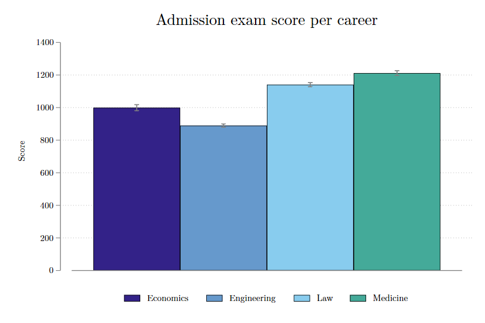
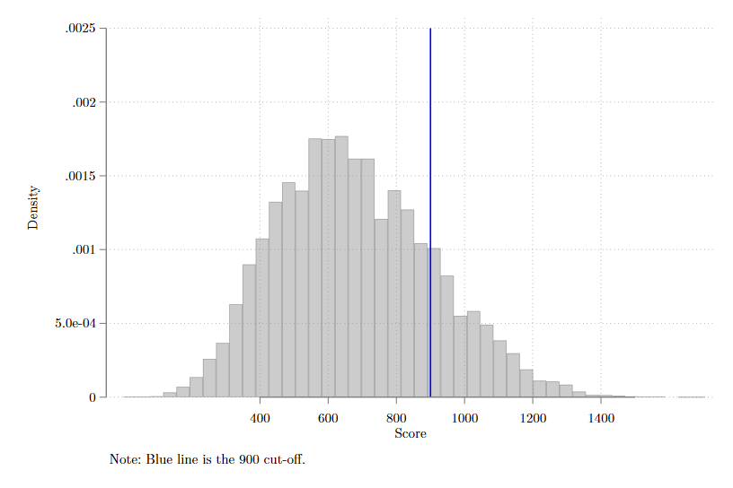
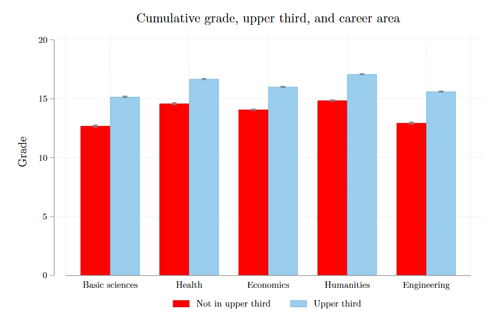

# Web Scraping Repository and Gallery

This repository contains various examples of web scraping projects using different tools and techniques. The datasets are mainly of Peruvian pages and files.

## Tools and Technologies

The projects in this repository use the following tools and technologies:

- Requests: A Python library for sending HTTP requests to websites and accessing their content.
- BeautifulSoup: A Python library for parsing HTML and XML documents and extracting data from them.
- Selenium: A Python library for automating web browsers and interacting with dynamic web pages.
- Pandas: A Python library for data manipulation and analysis.
- Camelot: A Python library for extracting tables from PDFs and exporting them to various formats.
- PyPDF2: A pure-python PDF library for manipulating PDF files and retrieving text and metadata from them.
- Matplotlib: A comprehensive library for creating static, animated, and interactive visualizations in Python.
- Seaborn: A library for making statistical graphics in Python using pandas data structures.

## Project List

The repository contains the following web scraping projects:

### UNMSM's Admission Exams
The objective of these codes is to scrape the results of the 2023-II and 2024-I UNMSM's exams, then clean it and finally get a simple dataset (in Stata format).

The exams comprises 100 multiple-choice questions —ranging from mathematics to social sciences, humanities, physics, chemistry, and biology— and spans a duration of 3 hours. Each correct answer carries 20 points, while an incorrect response deducts 1.125 points, and blank answers hold no point value. The maximum (and nearly impossible) score is 2,000 points.

For more details, please visit the OCA webpage: [link](https://admision.unmsm.edu.pe/portal/) 

 

### UNMSM's electoral register
The objetive of this code is to read almost 30 PDF files and consolidate all information in one simple dataset.

From time to time, UNMSM students are called to vote for the election of their student and administrative representatives. There is an Electoral Committee, which is in charge of publishing the electoral roll on the Internet, so that students know where they have to go to cast their vote. In addition, this list publishes relevant student information, such as their academic standing, aggregate grade and accumulated credits.

For more details, please visit the webpage of the Electoral Committee: [link](https://celectoral1.unmsm.edu.pe/) 

## Contact
If you have any questions or want to request the data for research purposes, feel free to contact me at rmcondorit@gmail.com. You can also follow me on [Twitter](https://twitter.com/rmcondor)  for more updates on my projects.